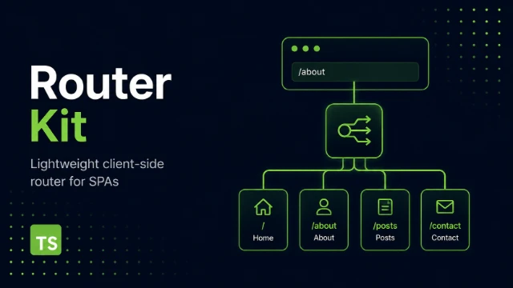

<!-- # Router Kit -->

<p align="center">
  
</p>

**Router Kit** — lightweight client-side router for SPAs.

---

## Installation

```bash
# npm
npm install @peccopa/router-kit

# pnpm
pnpm add @peccopa/router-kit

# yarn
yarn add @peccopa/router-kit
```

---

Небольшой клиентский роутер для одностраничных приложений (SPA).

Router Kit — это компактный TypeScript-роутер, предназначенный прежде всего для обучения и небольших frontend-проектов. Он предоставляет клиентскую навигацию, работу с историей браузера, подписку на изменения маршрута, разбор URL, динамические маршруты и параметры маршрутов без сложности полноценного routing-фреймворка.

Проект намеренно остаётся небольшим и не зависит от конкретного UI-фреймворка.

---

## Возможности

### Реализовано

- клиентская навигация через History API;
- навигация через `pushState`;
- поддержка кнопок Back / Forward;
- обработка `popstate`;
- управление жизненным циклом роутера через `start()` / `stop()`;
- подписка на изменения маршрута;
- отписка;
- уведомление о начальном состоянии;
- перехват внутренних ссылок;
- игнорирование внешних ссылок;
- сохранение стандартного поведения ссылок с модификаторами клавиатуры;
- поддержка `target="_blank"`;
- разбор URL;
- `href`;
- `origin`;
- `pathname`;
- `search`;
- `hash`;
- статические маршруты;
- динамические маршруты;
- параметры маршрутов;
- несколько динамических параметров;
- определение неизвестных маршрутов;
- сопоставление URL с маршрутами;
- приоритет точных маршрутов над динамическими.

### Пример

```ts
const router = new Router({
  '/': {
    name: 'home',
  },

  '/about': {
    name: 'about',
  },

  '/users': {
    name: 'users',
  },

  '/users/:id': {
    name: 'user',
  },

  '/users/:userId/posts/:postId': {
    name: 'user-post',
  },

  '/users/settings': {
    name: 'settings',
  },
});
```

URL:

```text
/users/42
```

может дать:

```ts
{
  location: {
    pathname: '/users/42',
    // ...
  },

  route: {
    name: 'user',
  },

  params: {
    id: '42',
  },
}
```

URL:

```text
/users/42/posts/7
```

может дать:

```ts
{
  location: {
    pathname: '/users/42/posts/7',
    // ...
  },

  route: {
    name: 'user-post',
  },

  params: {
    userId: '42',
    postId: '7',
  },
}
```

---

# Установка

```bash
npm install @peccopa/router-kit
```

---

# Базовое использование

```ts
import { Router } from '@peccopa/router-kit';

const router = new Router({
  '/': {
    name: 'home',
  },

  '/about': {
    name: 'about',
  },

  '/users': {
    name: 'users',
  },
});

router.subscribe((state) => {
  console.log(state);
});

router.start();
```

---

# Жизненный цикл роутера

Роутер не регистрирует глобальные обработчики событий в конструкторе.

Для запуска необходимо вызвать:

```ts
router.start();
```

Для остановки:

```ts
router.stop();
```

`start()` подключает обработчики:

- `popstate`;
- кликов по ссылкам.

`stop()` удаляет их.

Повторный вызов `start()` не создаёт дублирующиеся обработчики.

Вызов `stop()` у уже остановленного роутера ничего не делает.

---

# Навигация

Программная навигация выполняется через:

```ts
router.navigate('/about');
```

Внутри используется History API:

```ts
history.pushState(...)
```

После изменения URL роутер определяет новое состояние и уведомляет подписчиков.

Кнопки браузера **Back** и **Forward** поддерживаются через событие:

```ts
popstate;
```

---

# Работа со ссылками

Роутер перехватывает внутренние ссылки:

```html
<a href="/about">About</a>
```

и выполняет клиентскую навигацию без полной перезагрузки страницы.

Внешние ссылки не перехватываются:

```html
<a href="https://example.com">External</a>
```

Также сохраняется стандартное поведение браузера при:

- `Ctrl + click`;
- `Cmd + click`;
- `Shift + click`;
- `Alt + click`;
- `target="_blank"`.

---

# RouterLocation

Роутер представляет текущее положение браузера в виде отдельного объекта:

```ts
export type RouterLocation = {
  href: string;
  origin: string;
  pathname: string;
  search: string;
  hash: string;
};
```

Например, для URL:

```text
http://localhost:5500/users/42?page=2#comments
```

получаем:

```ts
{
  href: 'http://localhost:5500/users/42?page=2#comments',
  origin: 'http://localhost:5500',
  pathname: '/users/42',
  search: '?page=2',
  hash: '#comments',
}
```

`RouterLocation` описывает **фактический URL браузера**.

---

# RouterState

Подписчики получают полное состояние маршрутизатора:

```ts
export type RouterState = {
  location: RouterLocation;
  route: Route | undefined;
  params: Record<string, string>;
};
```

Пример:

```ts
router.subscribe((state) => {
  console.log(state.location);
  console.log(state.route);
  console.log(state.params);
});
```

Для:

```text
/users/42
```

результат может выглядеть так:

```ts
{
  location: {
    pathname: '/users/42',
    // ...
  },

  route: {
    name: 'user',
  },

  params: {
    id: '42',
  },
}
```

---

# Подписки

Подписаться на изменения состояния можно через:

```ts
const unsubscribe = router.subscribe((state) => {
  render(state);
});
```

Метод возвращает функцию для удаления подписки:

```ts
unsubscribe();
```

Это позволяет компонентам подписываться при создании и удалять подписку при уничтожении.

Роутер не знает, какие именно части приложения используют его состояние.

---

# Маршруты

Маршруты заранее описываются разработчиком:

```ts
const routes = {
  '/': {
    name: 'home',
  },

  '/about': {
    name: 'about',
  },

  '/users': {
    name: 'users',
  },
};
```

Текущая структура маршрута:

```ts
export interface Route {
  name: string;
}
```

Важно различать:

```text
RouterLocation
```

и:

```text
Route
```

`RouterLocation` описывает фактический URL браузера.

`Route` содержит описание маршрута приложения, которому этот URL соответствует.

Например:

```text
/users/42
```

может соответствовать:

```ts
{
  name: 'user',
}
```

а динамический параметр при этом будет находиться отдельно:

```ts
{
  id: '42',
}
```

---

# Статические маршруты

Статический маршрут задаётся конкретным URL:

```ts
const routes = {
  '/': {
    name: 'home',
  },

  '/about': {
    name: 'about',
  },

  '/users': {
    name: 'users',
  },
};
```

Примеры:

```text
/
/about
/users
```

---

# Динамические маршруты

Динамический сегмент обозначается через `:`:

```ts
'/users/:id';
```

Он может соответствовать:

```text
/users/1
/users/42
/users/alex
```

Значение динамического сегмента извлекается в `params`:

```ts
{
  id: '42',
}
```

---

# Несколько параметров

Маршрут может содержать несколько динамических сегментов:

```ts
'/users/:userId/posts/:postId';
```

Для URL:

```text
/users/42/posts/7
```

получаем:

```ts
{
  userId: '42',
  postId: '7',
}
```

---

# Сопоставление маршрутов

Сопоставление маршрута отделено от браузерной навигации.

Matcher получает:

```text
шаблон маршрута
+
pathname
```

и определяет, соответствует ли URL этому маршруту.

Например:

```text
/users/:id
```

совпадает с:

```text
/users/42
/users/alex
```

но не совпадает с:

```text
/users
/users/42/posts
/about
```

Такое разделение позволяет держать логику сопоставления маршрутов отдельно от работы с:

- `window`;
- `document`;
- History API;
- DOM-событиями.

---

# Приоритет маршрутов

У статических маршрутов должен быть более высокий приоритет, чем у динамических.

Например:

```ts
'/users/:id';
```

и:

```ts
'/users/settings';
```

оба технически могут совпасть с:

```text
/users/settings
```

Но правильным результатом является:

```text
/users/settings
```

а не:

```text
/users/:id
```

с параметром:

```ts
{
  id: 'settings',
}
```

Поэтому сначала проверяются точные маршруты, а затем динамические.

---

# Неизвестные маршруты

Если ни один маршрут не соответствует текущему URL, роутер возвращает:

```ts
route: undefined;
```

Например:

```text
/foobar
```

может дать:

```ts
{
  location: {
    pathname: '/foobar',
    // ...
  },

  route: undefined,

  params: {},
}
```

Решение о том, как отображать страницу 404, принимает само приложение:

```ts
router.subscribe((state) => {
  if (!state.route) {
    renderNotFound();
    return;
  }

  renderRoute(state);
});
```

---

# Архитектура

Общую архитектуру можно представить так:

```text
                    Браузер
                       │
             URL / click / history
                       │
                       ▼
                    Router
              ┌────────┼────────┐
              │        │        │
              ▼        ▼        ▼
          Навигация  Matching  События
              │        │        │
              └────────┼────────┘
                       ▼
                 RouterState
                       │
                       ▼
                 Подписчики
                       │
                       ▼
                  Приложение
```

Router отвечает за:

- навигацию;
- историю браузера;
- определение маршрута;
- параметры маршрута;
- уведомление подписчиков.

Приложение отвечает за:

- рендеринг;
- страницы;
- компоненты;
- бизнес-логику.

---

# Текущая структура проекта

Структура проекта развивается, но в целом выглядит следующим образом:

```text
src/
├── core/
│   └── Router.ts
│
├── types/
│   ├── listener.ts
│   ├── route.ts
│   ├── route-match.ts
│   ├── router-location.ts
│   └── router-state.ts
│
├── utils/
│   └── matchRoute.ts
│
└── index.ts
```

Структура может изменяться по мере развития проекта.

---

# План разработки

## Этап 1 — базовый Router

- [x] Класс `Router`
- [x] Конфигурация маршрутов
- [x] `navigate()`
- [x] `pushState`
- [x] `popstate`
- [x] `start()`
- [x] `stop()`
- [x] Система подписок
- [x] Отписка
- [x] Уведомление о начальном состоянии

## Этап 2 — работа с URL

- [x] `href`
- [x] `origin`
- [x] `pathname`
- [x] `search`
- [x] `hash`
- [x] Перехват внутренних ссылок
- [x] Определение внешних ссылок
- [x] Поддержка модификаторов клавиатуры
- [x] Поддержка `_blank`

## Этап 3 — определение маршрута

- [x] Статические маршруты
- [x] Неизвестные маршруты
- [x] Динамические сегменты
- [x] Параметры маршрутов
- [x] Несколько параметров
- [x] Отдельная функция сопоставления
- [x] Приоритет точных маршрутов
- [ ] Завершить правила приоритета
- [ ] Финализировать API сопоставления

## Этап 4 — тестирование

- [ ] Тесты `matchRoute()`
- [ ] Тесты статических маршрутов
- [ ] Тесты динамических маршрутов
- [ ] Тесты нескольких параметров
- [ ] Тесты некорректных маршрутов
- [ ] Тесты приоритета маршрутов
- [ ] Тесты `navigate()`
- [ ] Тесты `popstate`
- [ ] Тесты подписок
- [ ] Тесты отписок
- [ ] Тесты `start()` / `stop()`
- [ ] Тесты перехвата ссылок
- [ ] Тесты внешних ссылок
- [ ] Тесты модификаторов клавиатуры
- [ ] Тесты 404

## Этап 5 — подготовка пакета

- [ ] Финализировать публичный API
- [ ] Убрать внутренние экспорты
- [ ] Проверить TypeScript declarations
- [ ] Проверить сборку
- [ ] Проверить содержимое npm-пакета
- [ ] Финализировать README
- [ ] Добавить примеры использования
- [ ] Добавить CHANGELOG
- [ ] Подготовить версию `0.1.0`
- [ ] Опубликовать пакет

---

# Возможности для дальнейшего развития

Следующие возможности **не входят в текущий минимальный scope**.

Они перечислены как потенциальный roadmap, чтобы заранее видеть направление развития проекта и не пытаться реализовать всё сразу.

---

## Дополнительные возможности навигации

### Back

```ts
router.back();
```

Обёртка над:

```ts
history.back();
```

### Forward

```ts
router.forward();
```

### Go

```ts
router.go(-2);
router.go(1);
```

Обёртка над:

```ts
history.go();
```

---

# Замена текущей записи истории

Сейчас навигация использует:

```ts
history.pushState(...)
```

Можно добавить:

```ts
router.replace('/login');
```

с использованием:

```ts
history.replaceState(...)
```

Это полезно для редиректов, которые не должны добавлять новую запись в историю браузера.

---

# Опции навигации

Можно добавить:

```ts
router.navigate('/users/42', {
  replace: true,
});
```

Например:

```ts
type NavigateOptions = {
  replace?: boolean;
  state?: unknown;
};
```

---

# State History API

History API позволяет сохранять произвольное состояние:

```ts
router.navigate('/users/42', {
  state: {
    from: 'search',
  },
});
```

В будущем это состояние может стать частью `RouterState`:

```ts
{
  location: ...,
  route: ...,
  params: ...,
  historyState: {
    from: 'search',
  },
}
```

---

# Query Parameters

Сейчас query string доступен через:

```ts
location.search;
```

Например:

```text
/users?page=2&sort=name
```

можно получить как:

```text
?page=2&sort=name
```

В будущем можно добавить удобный разбор:

```ts
{
  page: '2',
  sort: 'name',
}
```

При этом нужно решить, должен ли Router заниматься разбором query parameters или оставить это приложению.

---

# Hash-навигация

Сейчас доступен:

```ts
location.hash;
```

В дальнейшем можно добавить:

- обработку hash-only navigation;
- события изменения hash;
- автоматический scroll;
- hash-маршруты;
- настраиваемую обработку hash.

---

# Необязательный завершающий `/`

Можно позволить считать:

```text
/users
```

и:

```text
/users/
```

одним маршрутом.

Например:

```ts
strictTrailingSlash: false;
```

---

# Декодирование параметров

Сейчас динамический параметр может содержать URL-encoded значение:

```text
/users/John%20Doe
```

В будущем можно автоматически преобразовывать его в:

```ts
{
  id: 'John Doe',
}
```

Потребуется учитывать:

- `decodeURIComponent`;
- некорректные encoded URL;
- encoded `/`;
- Unicode.

---

# Ограничения параметров

Можно добавить ограничения для динамических параметров.

Например:

```text
/users/:id<number>
```

должен совпадать с:

```text
/users/42
```

но не:

```text
/users/alex
```

Возможный вариант:

```text
/users/:id<[0-9]+>
```

Однако такая возможность значительно усложняет matcher и должна появляться только при наличии реальной необходимости.

---

# Необязательные параметры

Возможный синтаксис:

```text
/users/:id?
```

который позволит обрабатывать:

```text
/users
/users/42
```

---

# Wildcard-маршруты

Можно добавить маршруты вида:

```text
/files/*
```

или:

```text
/files/:path*
```

Например:

```text
/files/images/avatar.png
```

может дать:

```ts
{
  path: 'images/avatar.png',
}
```

---

# Catch-all маршрут

Можно поддержать специальный маршрут:

```ts
'*': {
  name: 'not-found',
}
```

который будет использоваться для обработки 404 непосредственно через конфигурацию маршрутов.

---

# Редиректы

Можно добавить:

```ts
'/old': {
  redirect: '/new',
}
```

или отдельный API:

```ts
router.redirect('/old', '/new');
```

В зависимости от назначения редиректа можно использовать `pushState` или `replaceState`.

---

# Guards

Можно добавить защиту маршрутов:

```ts
{
  path: '/admin',

  beforeEnter: () => {
    return isAuthenticated();
  },
}
```

Возможные результаты:

```ts
true;
false;
('/login');
```

Это позволит реализовать:

- проверку авторизации;
- проверку прав;
- защиту страниц;
- запрет ухода со страницы;
- условную навигацию.

---

# Глобальные guards

Возможный API:

```ts
router.beforeEach((to, from) => {
  // ...
});
```

и:

```ts
router.afterEach((to, from) => {
  // ...
});
```

---

# Отмена навигации

Например:

```ts
router.beforeEach(() => {
  return false;
});
```

может отменять переход.

В дальнейшем можно добавить информацию о причине отмены.

---

# События навигации

Можно реализовать события:

```text
navigation:start
navigation:success
navigation:cancel
navigation:error
```

Это может пригодиться для:

- индикаторов загрузки;
- аналитики;
- отладки;
- анимаций переходов.

---

# Предыдущий маршрут

`RouterState` потенциально может содержать предыдущий маршрут:

```ts
{
  current: ...,
  previous: ...,
}
```

Это удобно для интерфейсов, которым необходимо знать направление навигации.

---

# Метаданные маршрутов

Текущий маршрут содержит только:

```ts
{
  name: string;
}
```

В будущем можно добавить:

```ts
{
  name: 'admin',

  meta: {
    requiresAuth: true,
    title: 'Администрирование',
  },
}
```

Метаданные могут использоваться для:

- заголовков страниц;
- авторизации;
- breadcrumbs;
- аналитики;
- permissions;
- настроек UI.

---

# Вложенные маршруты

Можно реализовать иерархию:

```text
/dashboard
├── /profile
├── /settings
└── /users
```

Например:

```ts
{
  path: '/dashboard',

  children: [
    {
      path: 'profile',
    },

    {
      path: 'settings',
    },
  ],
}
```

Это уже значительно усложняет модель маршрутизации, поэтому не относится к ближайшему roadmap.

---

# Группы маршрутов

Маршруты можно группировать:

```ts
router.group('/admin', [
  // ...
]);
```

Это может использоваться для:

- общих метаданных;
- общих guards;
- общих layout;
- организации конфигурации.

---

# Layout-маршруты

Маршрут потенциально может определять layout:

```text
Приложение
└── DashboardLayout
    ├── Profile
    ├── Settings
    └── Users
```

Это уже приближает Router к полноценной системе маршрутизации приложения.

---

# Загрузка данных маршрута

Можно добавить `loader`:

```ts
{
  path: '/users/:id',

  loader: async ({ params }) => {
    return getUser(params.id);
  },
}
```

Результат загрузки может стать частью состояния маршрута.

---

# Lazy Routes

Маршруты могут загружать код лениво:

```ts
{
  path: '/admin',

  component: () => import('./pages/Admin'),
}
```

Это позволит реализовать code splitting.

---

# Интеграция с UI-фреймворками

Core Router остаётся независимым от UI-фреймворка.

В будущем можно создать отдельные адаптеры для:

- React;
- Vue;
- Svelte;
- Web Components.

Например, для React:

```ts
useRouter();
useLocation();
useParams();
```

При этом сам `Router Kit` не должен зависеть от React.

---

# Восстановление позиции прокрутки

Можно автоматически сохранять и восстанавливать scroll position.

Например:

```text
Страница A
    ↓
scroll 800px
    ↓
Страница B
    ↓
Back
    ↓
восстановить 800px
```

---

# View Transitions

В будущем можно добавить интеграцию с View Transitions API браузера.

Например:

```ts
router.navigate('/about', {
  transition: true,
});
```

Это должно оставаться необязательной возможностью.

---

# Заголовок документа

Маршрут может содержать:

```ts
{
  name: 'about',
  title: 'О проекте',
}
```

и Router потенциально сможет автоматически обновлять:

```ts
document.title;
```

Однако это также может остаться ответственностью приложения.

---

# Обработка ошибок

Можно добавить отдельный механизм обработки ошибок навигации:

```ts
router.subscribeError((error) => {
  // ...
});
```

Возможные категории:

- некорректный URL;
- ошибка навигации;
- отказ guard;
- ошибка loader;
- некорректная конфигурация маршрута;
- ошибка декодирования.

---

# Режим отладки

Можно добавить:

```ts
new Router(routes, {
  debug: true,
});
```

и выводить:

```text
[Router] navigation started
[Router] pathname: /users/42
[Router] matched: /users/:id
[Router] params: { id: "42" }
```

---

# Инспекция маршрутов

Для тестирования и отладки могут пригодиться:

```ts
router.getRoutes();
```

или:

```ts
router.match('/users/42');
```

---

# Контекст Router

Для framework-адаптеров можно реализовать:

```tsx
<RouterProvider router={router}>
  <App />
</RouterProvider>
```

Сам core Router при этом останется независимым от UI-фреймворка.

---

# SSR

Текущий Router ориентирован на браузер и использует:

```ts
window;
document;
history;
```

В дальнейшем можно разделить:

```text
Core routing
      │
      ├── Browser adapter
      └── Server adapter
```

Тогда сопоставление маршрутов можно будет использовать независимо от браузера.

Это позволит применять Router в:

- SSR;
- static generation;
- Node.js;
- тестах;
- серверных приложениях.

---

# Memory History

Для тестов и сред без браузера можно добавить memory history:

```ts
const router = new Router(routes, {
  history: new MemoryHistory(),
});
```

Это позволит отказаться от `window.history` в тестовой среде.

---

# Hash Router

В качестве альтернативы History API можно поддержать hash-маршрутизацию:

```text
/#/about
```

вместо:

```text
/about
```

Например:

```ts
createHashRouter(...)
```

или через отдельный history adapter.

---

# Абстракция History

Можно выделить интерфейс:

```ts
interface HistoryAdapter {
  push(path: string): void;
  replace(path: string): void;
  back(): void;
  forward(): void;
  listen(listener: () => void): () => void;
}
```

Это сделает core Router более тестируемым и расширяемым.

---

# Base URL

Если приложение размещено не в корне домена:

```text
/my-app/
```

может потребоваться:

```ts
new Router(routes, {
  base: '/my-app',
});
```

чтобы маршруты корректно работали с:

```text
/my-app/about
```

---

# Локализованные маршруты

В будущем можно поддержать:

```text
/en/about
/ru/about
/de/about
```

с извлечением локали:

```ts
{
  locale: 'en',
}
```

Но чаще это является ответственностью самого приложения.

---

# Типизированные параметры

Текущая модель:

```ts
Record<string, string>;
```

довольно свободная.

В будущем TypeScript может автоматически выводить параметры из маршрута:

```ts
'/users/:id';
```

→

```ts
{
  id: string;
}
```

Это позволит получить более строгую типизацию.

---

# Типизированная навигация

Более продвинутая версия могла бы не позволять передавать некорректные параметры на этапе компиляции.

Например:

```ts
router.navigate('/users/:id', {
  id: '42',
});
```

вместо ручной сборки:

```ts
'/users/42';
```

Это мощная возможность, но она существенно усложняет API.

---

# Генерация URL

Можно добавить:

```ts
router.build('/users/:id', {
  id: '42',
});
```

результат:

```text
/users/42
```

Это позволит централизовать создание URL и уменьшить количество ошибок.

---

# Компонент Link

Для UI-адаптеров можно предоставить:

```tsx
<Link to="/about">О проекте</Link>
```

При этом core Router останется framework-agnostic.

---

# Breadcrumbs

При наличии вложенных маршрутов и metadata можно автоматически строить:

```text
Главная → Пользователи → Андрей → Посты
```

---

# Интеграция с аналитикой

После появления navigation events приложение сможет самостоятельно отправлять данные:

```ts
router.afterEach((to, from) => {
  analytics.trackPageView(to.location.pathname);
});
```

Сам Router при этом не должен зависеть от конкретной системы аналитики.

---

# Производительность

В случае реальной необходимости можно оптимизировать:

- компиляцию шаблонов маршрутов;
- кэширование matcher;
- ранжирование маршрутов;
- предварительное извлечение параметров;
- мемоизацию результатов;
- предотвращение лишних уведомлений подписчиков.

Оптимизации следует добавлять только после появления реальной проблемы производительности.

---

# Безопасность

В будущем необходимо учитывать:

- небезопасные URL schemes;
- `javascript:` URL;
- некорректные URL;
- encoded paths;
- внешние origins;
- open redirect;
- небезопасные redirect-конфигурации.

Роутер не должен без проверки считать произвольный внешний URL внутренним маршрутом приложения.

---

# Стратегия тестирования

В дальнейшем тестирование желательно разделить на три уровня.

## Unit-тесты

Тестирование чистых функций:

```text
matchRoute()
```

Например:

```text
/users/:id + /users/42
/users/:id + /users/alex
/users/:id + /about
```

## Тесты Router

Проверка:

```text
navigate()
start()
stop()
subscribe()
unsubscribe()
popstate
```

## Интеграционные тесты

Проверка полного сценария:

```text
клик по ссылке
      ↓
навигация
      ↓
сопоставление маршрута
      ↓
RouterState
      ↓
подписчик
```

---

# Принципы проекта

### Компактность

Router должен оставаться достаточно маленьким, чтобы разработчик мог полностью прочитать его исходный код.

### Framework-agnostic

Core не должен зависеть от React, Vue, Svelte и других UI-фреймворков.

### TypeScript-first

Публичный API должен иметь понятные и полезные TypeScript-типы.

### Явность

Навигация, подписки и жизненный цикл должны быть явно представлены в API.

### Тестируемость

Логику сопоставления маршрутов желательно держать отдельно от браузерных API.

### Расширяемость

Продвинутые возможности должны добавляться без необходимости усложнять базовое ядро.

### Минимум зависимостей

Роутер должен по возможности обходиться стандартными браузерными API и TypeScript.

---

# Что не является целью проекта

Router Kit не ставит целью стать заменой зрелым routing-библиотекам.

В первоначальный scope не входят:

- полная совместимость с React Router;
- сложная система вложенных маршрутов;
- полноценная система загрузки данных;
- готовая система авторизации;
- state management;
- UI-фреймворк;
- управление жизненным циклом всего приложения;
- серверный framework;
- система аналитики;
- UI component system.

Все эти возможности могут быть исследованы в будущем, но они не должны разрушать простоту основного Router.

---

# Текущий статус

**В разработке.**

Основная функциональность клиентского роутера уже реализована.

Текущий этап:

```text
Динамические маршруты
        ↓
Параметры маршрутов
        ↓
Приоритет маршрутов
        ↓
Тесты
        ↓
Очистка API
        ↓
README
        ↓
npm-пакет
```

---

# Долгосрочная цель

Цель проекта — не создать максимально большой роутер.

Цель — создать Router, который одновременно:

```text
небольшой
    +
понятный
    +
типизированный
    +
тестируемый
    +
переиспользуемый
```

Исходный код должен быть достаточно компактным, чтобы разработчик мог проследить весь путь:

```text
URL браузера
    ↓
навигация
    ↓
сопоставление маршрута
    ↓
извлечение параметров
    ↓
RouterState
    ↓
подписчики
    ↓
приложение
```

Именно это является главным учебным назначением Router Kit.
